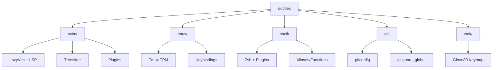
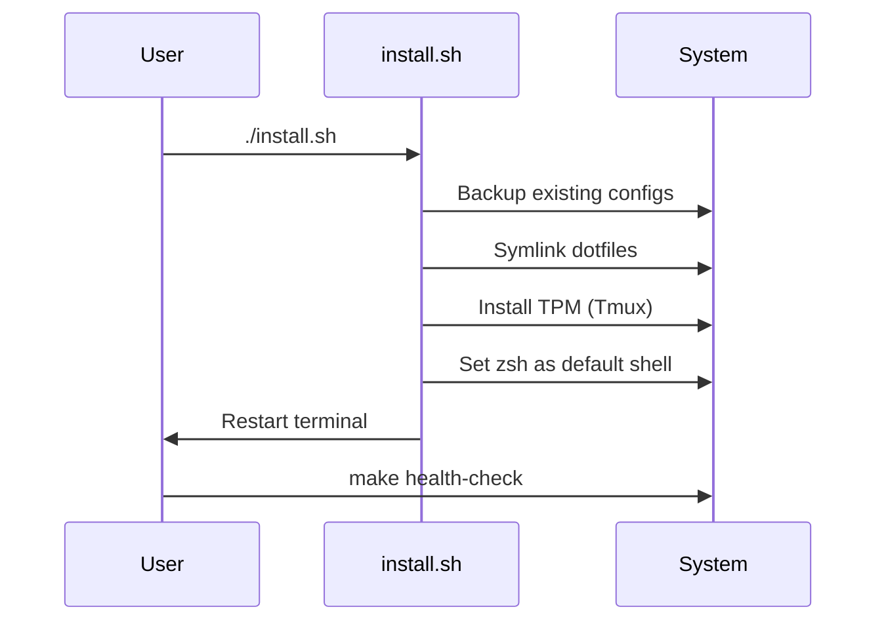

# Dotfiles Repository

Personal development environment for Linux, optimized for Python/Svelte/Rust/Go development with Neovim, Tmux, and Zsh.

## Architecture



## Design Philosophy

**Symlink-based**: All configs symlinked from repo → transparent, version-controlled, no magic.

**Modular**: Update tools independently. No monolithic config file.

**Reproducible**: `./install.sh` on fresh system → instant dev environment.

## Key Components

### Neovim (`nvim/`)
LazyVim distribution with language servers for Python, Svelte, Rust, Go. Configured via:
- `init.lua` - Bootstrap
- `lua/config/` - Options, keymaps, autocmds
- `lua/plugins/` - Plugin specs (lazy-loaded)
- `lua/plugins/dotfiles.lua` - Shows `.env`, `.claude/` in explorer

### Tmux (`tmux/`)
Session management with vim-style navigation, plugin manager (TPM), and custom theme.

### Shell (`shell/`)
Zsh configuration split into:
- `zshrc` - Main config with Aerometrix-branded prompt
- `aliases.sh` - Command shortcuts
- `exports.sh` - Environment variables
- `functions.sh` - Shell utilities

### Git (`git/`)
Global config with:
- User settings (name, email, GPG)
- Default branch: `main`
- Refined `.gitignore_global` - ignores build artifacts, allows lockfiles

### ZMK (`zmk/`)
Glove80 Colemak Mod-DH keymap build integration.

## Installation Flow



## Development Workflow

1. **Clone & Install**: `git clone <repo> ~/.dotfiles && cd ~/.dotfiles && ./install.sh`
2. **Language Setup**: `bash languages/python.sh` (or svelte/rust/go)
3. **Health Check**: `make health-check`
4. **Updates**: `make sync` (pulls latest + updates plugins)

## Git Commit Guidelines

**NO `Co-Authored-By` lines in commits.** Keep commits concise, imperative mood:

```
Add feature X to improve Y

- Detail 1
- Detail 2
```

## File Visibility

Dotfiles (`.env`, `.claude/`) are visible in Neovim by default via `lua/plugins/dotfiles.lua`. This configures `snacks.nvim` pickers to show hidden files.

## Maintenance

- **Update plugins**: `make sync`
- **Check health**: `make health-check`
- **Add language**: Create `languages/<lang>.sh` script
- **Customize keybinds**: Edit `nvim/lua/config/keymaps.lua` or `tmux/tmux.conf`
